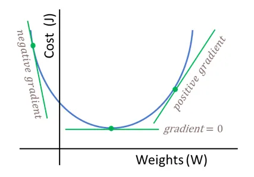

# Week 8: Introduction to Deep Learning {#week8}

## Slides{.unnumbered}

- 8 Introduction to Deep Learning ([link](https://github.com/svallejovera/cta_updated/blob/main/slides/8%20Neural%20Networks%20and%20Word%20Embeddings.pptx) or in Perusall) to slides)

## Why Neural Networks in a Text Analysis Course?

Neural networks are just *parameterized functions* that we fit by minimizing a loss function. If that sounds familiar, it should: it is the same basic idea behind regression. The two big changes are:

1. We stack many simple functions (layers) on top of each other.
2. We add **nonlinearities** (activation functions), so the model can learn more flexible patterns.

This week we will (i) train a tiny neural network **by hand** (forward pass → loss → gradients → update), and then (ii) connect the idea of “learned weights” to **word embeddings**.

## Setup

As always, we first load the packages that we'll be using:

```{r, warning = F, message = F}
library(tidyverse)  
library(tidylog)    
library(knitr)   
```

We will use tiny, toy numbers so that the arithmetic is transparent.

---

## Part 1: A single neuron with a **linear** activation (regression)

A “single neuron” takes an input $x$, multiplies it by a weight $w$, adds a bias $b$, and outputs:

$$
\hat{y} = wx + b
$$

This is literally the same functional form as simple linear regression. The key point is not novelty, but rather to practice the mechanics of *gradient descent*.

### A tiny dataset

Let's use three observations:

```{r}
toy_lin <- tibble(
  x = c(0, 1, 2),
  y = c(0, 1, 4)
)

toy_lin
```

### Forward pass (by hand)

Pick initial parameters (intentionally a little “wrong”):

- $w = 0.4$
- $b = 0.2$

Compute predictions:

$$
\hat{y}_i = w x_i + b
$$

```{r}
w <- 0.4
b <- 0.2

toy_lin <- toy_lin %>%
  mutate(
    yhat = w * x + b,
    error = yhat - y
  )

kable(toy_lin)
```

### Loss (Mean Squared Error)

We'll use the “half MSE” because it makes derivatives cleaner (will see what we mean by this in a minute):

$$
L = \frac{1}{2n}\sum_{i=1}^{n}(\hat{y}_i - y_i)^2
$$

This is called the *loss function*, the *cost function*, or the *error function*. 

```{r}
loss_lin <- (1/(2*nrow(toy_lin))) * sum((toy_lin$yhat - toy_lin$y)^2)
loss_lin
```

```{r}
# Visualizing how well the line fits 

toy_lin %>%
  ggplot(aes(x = x, y = y)) +
  geom_point(alpha=0.6) +
  geom_point(aes(x = x, y = yhat),
             color = '#2C2C54') +
  geom_line(aes(x = x, y = yhat),
             color = '#2C2C54') +
  labs(
    title = "Actual and predicted values over x (before the update)",
    x = "x",
    y = "Value"
  )
```


### Gradients (this is the whole game)

That's an ok prediction. But there is probably a better line we can plot that will better predict the observed values. We will do some backpropagation. 

During backpropagation, we take the partial derivative of the error function with respect to each weight and bias in the model. The error function does not contain any weights or biases in its equation so we use the **chain rule** to do so. The result of doing this is a direction and magnitude in which each parameter should be tuned to minimize the error function. This concept is called *gradient descent*.

I will try to explain why we use the derivative of the errors and the chain rule as intuitively as possible, but if you want another, more detailed, explanation of the process, I suggest you check [this video](https://www.youtube.com/watch?app=desktop&v=tIeHLnjs5U8). 

We are looking for better values to give $w$ and $b$. 

```{r gradient, echo=FALSE, fig.cap="Simplified cost function curve. In NNs this function might not be convex.", out.width = '100%'}

```

This is what we have:

- $\hat{y}_i = wx_i + b$
- $e_i = \hat{y}_i - y_i$
- $L = \frac{1}{2n}\sum e_i^2$

Derivative w.r.t. predictions:

$$
\frac{\partial L}{\partial \hat{y}_i} = \frac{1}{n}(\hat{y}_i - y_i) = \frac{1}{n}e_i
$$

And since $\frac{\partial \hat{y}_i}{\partial w} = x_i$ and $\frac{\partial \hat{y}_i}{\partial b} = 1$, we get:

$$
\frac{\partial L}{\partial w} = \frac{1}{n}\sum_{i=1}^{n} e_i x_i
\qquad
\frac{\partial L}{\partial b} = \frac{1}{n}\sum_{i=1}^{n} e_i
$$

Let's compute these gradients in R:

```{r}
n <- nrow(toy_lin)

dL_dw_lin <- (1/n) * sum(toy_lin$error * toy_lin$x)
dL_db_lin <- (1/n) * sum(toy_lin$error)

dL_dw_lin
dL_db_lin
```

### One gradient descent update

Gradient descent update rule:

$$
w \leftarrow w - \alpha \frac{\partial L}{\partial w}
\qquad
b \leftarrow b - \alpha \frac{\partial L}{\partial b}
$$

Let's choose a learning rate $\alpha = 0.2$ and update once:

```{r}
alpha <- 0.2

w_new <- w - alpha * dL_dw_lin
b_new <- b - alpha * dL_db_lin

c(w_old = w, w_new = w_new, b_old = b, b_new = b_new)
```

Now recompute the loss to check that we improved:

```{r}
toy_lin_after <- toy_lin %>%
  mutate(
    yhat_new = w_new * x + b_new,
    error_new = yhat_new - y
  )

loss_lin_after <- (1/(2*n)) * sum((toy_lin_after$yhat_new - toy_lin_after$y)^2)

c(loss_before = loss_lin, loss_after = loss_lin_after)
```

```{r}
# Visualizing how well the UPDATED line fits 

toy_lin_after %>%
  ggplot(aes(x = x, y = y)) +
  geom_point(alpha=0.6) +
  geom_point(aes(x = x, y = yhat_new),
             color = '#2C2C54') +
  geom_line(aes(x = x, y = yhat_new),
             color = '#2C2C54') +
  labs(
    title = "Actual and predicted values over x (before the update)",
    x = "x",
    y = "Value"
  )
  labs(
    title = "Actual and predicted values over x (after the update)",
    x = "x",
    y = "Value"
  )
```


If you got a smaller loss after the update, congratulations: you have trained a “neural network” (a very small one).

---

## Part 2: A single neuron with a **sigmoid** activation (a classic neural-network move)

The linear neuron is useful for intuition, but it is not *distinctively neural-network-ish*. The distinctive move is adding a nonlinearity.

We define:

1. Pre-activation (the “weighted sum”):
$$
a = wx + b
$$

2. Activation (sigmoid):
$$
\hat{y} = \sigma(a) = \frac{1}{1 + e^{-a}}
$$

We will keep the same “half MSE” loss:

$$
L = \frac{1}{2n}\sum_{i=1}^{n}(\hat{y}_i - y_i)^2
$$

### A tiny dataset for sigmoid

To keep things simple, let's do a “probability-like” target:

```{r}
toy_sig <- tibble(
  x = c(0, 1, 2),
  y = c(0, 1, 1)  # not perfect, just a toy target
)

toy_sig
```

### Define sigmoid

```{r}
sigmoid <- function(a) 1 / (1 + exp(-a))
```

### Forward pass

Initialize:

- $w = 0.8$
- $b = -0.4$

Compute:

- $a_i = wx_i + b$
- $\hat{y}_i = \sigma(a_i)$

```{r}
w <- 0.8
b <- -0.4
n <- nrow(toy_sig)

toy_sig <- toy_sig %>%
  mutate(
    a = w * x + b,
    yhat = sigmoid(a),
    error = yhat - y
  )

kable(toy_sig)
```

### Loss

```{r}
loss_sig <- (1/(2*n)) * sum((toy_sig$yhat - toy_sig$y)^2)
loss_sig
```

### Backprop (chain rule, step-by-step)

We want $\frac{\partial L}{\partial w}$ and $\frac{\partial L}{\partial b}$.

For each observation $i$:

1) Loss derivative w.r.t. prediction:
$$
\frac{\partial L}{\partial \hat{y}_i} = \frac{1}{n}(\hat{y}_i - y_i)
$$

2) Sigmoid derivative:
$$
\frac{\partial \hat{y}_i}{\partial a_i} = \hat{y}_i(1-\hat{y}_i)
$$

3) Pre-activation derivatives:
$$
\frac{\partial a_i}{\partial w} = x_i
\qquad
\frac{\partial a_i}{\partial b} = 1
$$

Combine them:

$$
\frac{\partial L}{\partial w}
= \sum_{i=1}^{n}
\left(
\frac{\partial L}{\partial \hat{y}_i}
\cdot
\frac{\partial \hat{y}_i}{\partial a_i}
\cdot
\frac{\partial a_i}{\partial w}
\right)
$$

$$
\frac{\partial L}{\partial b}
= \sum_{i=1}^{n}
\left(
\frac{\partial L}{\partial \hat{y}_i}
\cdot
\frac{\partial \hat{y}_i}{\partial a_i}
\cdot
\frac{\partial a_i}{\partial b}
\right)
$$

Let's compute these gradients explicitly:

```{r}
# dL/dyhat_i
dL_dyhat <- (1/n) * (toy_sig$yhat - toy_sig$y)

# dyhat_i/da_i for sigmoid
dyhat_da <- toy_sig$yhat * (1 - toy_sig$yhat)

# da_i/dw and da_i/db
da_dw <- toy_sig$x
da_db <- rep(1, n)

# chain rule
dL_dw_sig <- sum(dL_dyhat * dyhat_da * da_dw)
dL_db_sig <- sum(dL_dyhat * dyhat_da * da_db)

dL_dw_sig
dL_db_sig
```

### One update + check the loss

```{r}
alpha <- 0.8  # you can play with this

w_new <- w - alpha * dL_dw_sig
b_new <- b - alpha * dL_db_sig

c(w_old = w, w_new = w_new, b_old = b, b_new = b_new)
```

```{r}
toy_sig_after <- toy_sig %>%
  mutate(
    a_new = w_new * x + b_new,
    yhat_new = sigmoid(a_new)
  )

loss_sig_after <- (1/(2*n)) * sum((toy_sig_after$yhat_new - toy_sig_after$y)^2)

c(loss_before = loss_sig, loss_after = loss_sig_after)
```

If loss decreased, the network is moving in the right direction. If it increased, reduce $\alpha$.

### (Optional) Train for multiple steps

This is the exact same logic, repeated.

```{r}
train_sigmoid_one_neuron <- function(x, y, w_init, b_init, alpha, steps) {
  sigmoid <- function(a) 1 / (1 + exp(-a))
  n <- length(x)

  w <- w_init
  b <- b_init

  history <- tibble(step = integer(), loss = double(), w = double(), b = double())

  for (s in 1:steps) {
    a <- w * x + b
    yhat <- sigmoid(a)

    loss <- (1/(2*n)) * sum((yhat - y)^2)

    dL_dyhat <- (1/n) * (yhat - y)
    dyhat_da <- yhat * (1 - yhat)

    dL_dw <- sum(dL_dyhat * dyhat_da * x)
    dL_db <- sum(dL_dyhat * dyhat_da * 1)

    w <- w - alpha * dL_dw
    b <- b - alpha * dL_db

    history <- bind_rows(history, tibble(step = s, loss = loss, w = w, b = b))
  }

  history
}

hist_sig <- train_sigmoid_one_neuron(
  x = toy_sig$x,
  y = toy_sig$y,
  w_init = 0.8,
  b_init = -0.4,
  alpha = 0.8,
  steps = 30
)

tail(hist_sig)
```

```{r}
ggplot(hist_sig, aes(x = step, y = loss)) +
  geom_line() +
  geom_point(alpha=.6) +
  labs(
    title = "Training a one-neuron sigmoid network (toy data)",
    x = "Gradient descent step",
    y = "Loss"
  )
```

---

## How this connects to word embeddings

The reason we did this “by hand” is to demystify the basic mechanism:

- You start with **random weights**.
- You compute predictions.
- You measure how wrong you are (loss).
- You compute gradients (how to change weights to reduce loss).
- You update weights.

Word embeddings are also **weights**. The difference is that:

- Instead of learning one weight $w$, we learn a *vector* of weights for each word: $\mathbf{w}_{\text{word}} \in \mathbb{R}^d$.
- Training nudges these vectors so that the model becomes better at its prediction task (e.g., predicting nearby words, or predicting masked tokens).

So when you hear “an embedding is learned,” you should translate that as:

> “Gradient descent moved a bunch of weights until the model’s predictions improved.”

Next week, we will use this same story (forward pass → loss → gradients → update), but we will scale it up to many dimensions and many tokens.

---

## References

- *Training a neural network by hand* (Medium post): https://medium.com/data-science/training-a-neural-network-by-hand-1bcac4d82a6e
